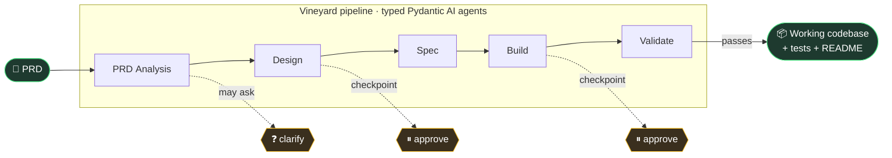
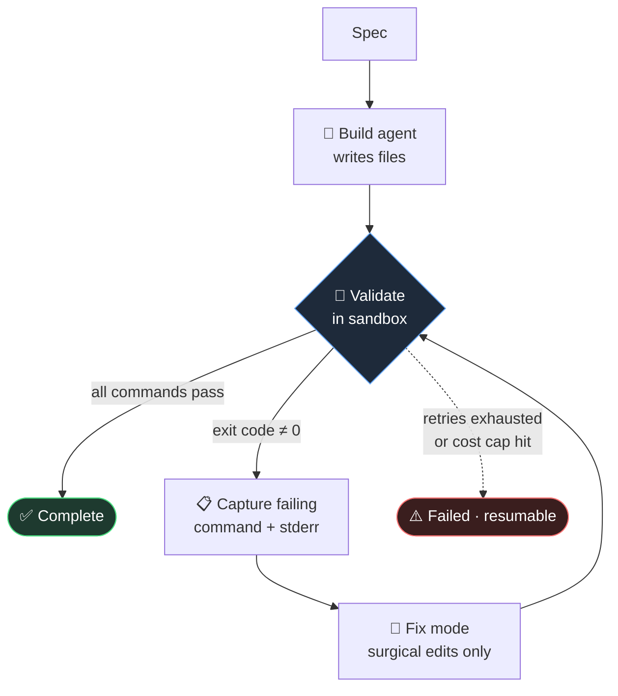

# 🌱 Vineyard

**A spec-driven code factory.** Hand it a product requirements doc; it plans,
specs, builds, and *verifies* a working multi-stack codebase — pausing for your
approval at the points that matter.

Vineyard runs as a local [Textual](https://textual.textualize.io/) terminal UI.
Under the hood it's a pipeline of typed [Pydantic AI](https://ai.pydantic.dev/)
agents, a sandboxed verification step that actually compiles and tests the
output, and a self-healing loop that feeds failures back to the builder until
the code passes.

> **Why it exists.** "Generate me an app" is a solved party trick. The hard part
> is everything around it: a reviewable spec before code is written, a human in
> the loop at design and build, ground-truth verification that the result runs,
> and an audit trail of cost and decisions. Vineyard is the *governance layer*;
> the code generator underneath is swappable.

---

## What it does



Each phase is a Pydantic AI `Agent` with a **typed Pydantic output**, so every
intermediate artifact (the enriched PRD, the feature/flow design, the API/DB/task
spec) is structured, inspectable, and editable in the TUI — not an opaque blob.

| Phase | Produces | Human gate |
|---|---|---|
| **PRD Analysis** | Enriched PRD, target users, core problem | May ask clarifying questions |
| **Design** | Features, user stories, acceptance criteria, flows | ⏸ approval checkpoint |
| **Spec** | API endpoints, DB schema, engineering tasks | — |
| **Build** | The actual source files | ⏸ approval checkpoint |
| **Validate** | Compile/test results in a sandbox | Gates completion |

Clarifying questions and approvals are real pauses: the run stops, you answer or
approve in the TUI, and your input flows into the downstream prompts.

---

## The part I'm proud of: build verifies itself

A model claiming "done" means nothing. Vineyard's **Validate** phase runs the
generated code in a throwaway sandbox (Docker locally, or
[E2B](https://e2b.dev/) micro-VMs in the cloud) using stack-specific commands —
`pnpm build`, `pytest`, `terraform validate`, etc. If anything fails, the exact
failing command and its stderr are fed back into the builder as a **fix-mode
prompt**, and it surgically edits only the broken files. Then it re-validates.



The loop is bounded by a retry limit **and** a hard dollar cost cap — a failed
phase is cleaner than a runaway bill. Everything is resumable: stop a run, fix
the spec, and pick up where it left off.

---

## Two build engines, one pipeline

Because the codegen step is just an `Executor` behind a protocol, the engine is
pluggable. The planning, review gates, verification, and audit trail stay the
same regardless of which one builds.

| Engine | What it is | When |
|---|---|---|
| **`pydantic_ai`** *(default)* | A Pydantic AI agent with file-writing tools, routed through the Pydantic AI Gateway. Runs locally, no extra infra. | Everyday use |
| **`managed_agents`** *(beta)* | Anthropic's cloud [Managed Agents + **Outcomes**](https://platform.claude.com/docs/en/managed-agents/overview): the build is defined as an *outcome* (deliverable + the stack rubric), and an independent grader agent scores it and iterates until satisfied. | Long-horizon, self-grading builds |

Both report token-level cost, and both stream their work — file writes, tool
calls, grading iterations — live into the TUI event log. Observability flows to
[Logfire](https://logfire.pydantic.dev/) either way (the gateway for the local
engine; direct SDK instrumentation for the cloud one).

---

## Supported stacks

Seven opinionated targets. Each pins current LTS versions in its system prompt
and ships a grading rubric, so the agent builds the way a senior dev on that
stack would — not whatever was in its training data.

| Stack | Stack details |
|---|---|
| `nextjs` | Next.js 15 · React 19 · TypeScript · Tailwind v4 · Drizzle |
| `rails` | Rails 8.0 · Hotwire · Solid Queue · ViewComponent |
| `fastapi` | FastAPI · SQLAlchemy 2 · Pydantic v2 · Alembic |
| `django` | Django 5.2 · DRF · HTMX · psycopg 3 |
| `backend` | Pure-API FastAPI **+ Terraform** (AWS App Runner + RDS) |
| `cli` | Python CLI app (Typer + Rich) |
| `tui` | Python TUI app (Textual) |

---

## Quickstart

Vineyard uses [`uv`](https://docs.astral.sh/uv/).

```bash
uv sync                      # install from the lockfile
vineyard config pydantic-ai-gateway-api-key pylf_v1_us_...   # the one required key
uv run vineyard              # launch the TUI → press 'n' for a new run
```

Or run a build non-interactively:

```bash
uv run vineyard run prd.md --name "Bandung CRM" --stack nextjs --yes
```

Generated projects land in `~/.vineyard/runs/<run-id>/output/build/`, each with
its own README for installing and running that stack.

### Optional configuration

```bash
vineyard config logfire-token pylf_v1_us_...        # tracing / observability
vineyard config logfire-read-token pylf_v1_us_...   # enables `vineyard cost`
vineyard config anthropic-api-key sk-ant-...        # for the managed_agents engine
vineyard config e2b-api-key e2b_...                 # cloud sandbox validation
```

All settings are also plain `VINEYARD_*` env vars (see `.env.example`). Config
lives in `~/.vineyard/config.env` (chmod 600); `vineyard config` with no args
prints it.

---

## CLI reference

```bash
vineyard                       # open the TUI
vineyard run <prd.md> --name … --stack … [--executor …] [--yes]
vineyard list                  # all runs
vineyard resume  <run-id>      # continue a paused / failed run
vineyard restart <run-id>      # wipe outputs, re-run from the top
vineyard delete  <run-id>      # remove a run + its files
vineyard cost    <run-id>      # gateway-recorded cost from Logfire
vineyard stacks                # list stacks
vineyard config [key] [value]  # show / set config
```

`<run-id>` accepts any unique prefix (e.g. `vineyard delete abc12345`).

**TUI keys** — Home: `n` new · `enter` open · `d` delete · `r` refresh · `q` quit.
Run detail: `v` view phase · `a` approve · `r` resume · `x` stop · `R` restart ·
`o` output dir. Phase view: `Ctrl+S` save clarification answers.

---

## Architecture at a glance

```
src/vineyard/
├── orchestrator/   # the phase loop: checkpoints, clarifications, retries, cost cap
├── agents/         # one Pydantic AI agent per phase (PRD, design, spec, QA)
├── build/          # executor protocol + pydantic_ai and Outcomes engines
├── validate/       # sandbox runners (Docker, E2B) behind one protocol
├── stacks/         # 7 stack profiles: system prompt + rubric + validate commands
├── models/         # typed phase outputs + run state machine
├── storage/        # SQLite run persistence
└── tui/            # Textual screens + widgets
```

Design choices worth calling out:

- **Typed everything.** Phase outputs are Pydantic models, so the spec is an
  object you can render, diff, and edit — not free text.
- **Protocols, not branches.** Build engines and validation backends are swapped
  via small protocols (`Executor`, `Validator`), each resolved by a factory that
  degrades gracefully when a dependency or key is missing.
- **Bounded autonomy.** Retry caps, a dollar cost ceiling, and human approval
  gates keep an autonomous loop from running away.
- **Tested.** 77 unit tests cover the prompt builders, executors (against mock
  clients — no network), validators, pricing math, and the orchestrator helpers.

---

## Status

A personal project and portfolio piece, under active development. The cloud
**Outcomes** engine targets a beta Anthropic API and needs beta access; the
default local engine has no such requirement. Treat generated code as a
strong first draft that the validate loop has at least compiled and tested —
not as unreviewed production code.

## License

MIT
